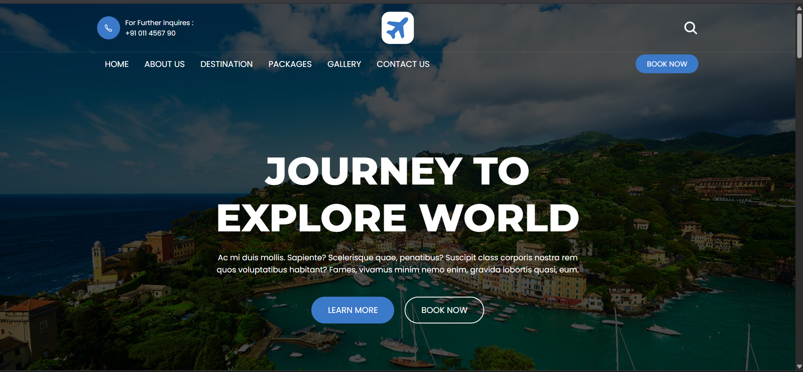
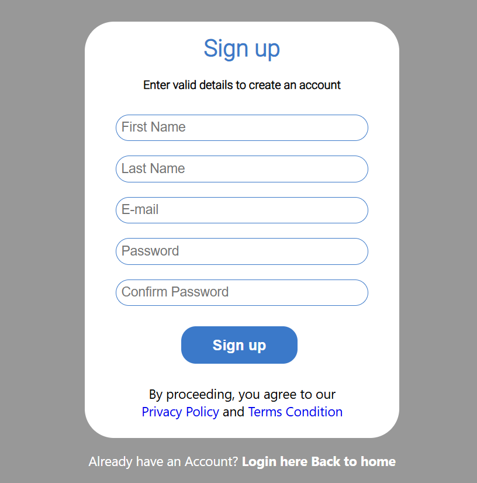

<h1> # Wanderlust: A Static Travel Website</h1>

Wanderlust is a static travel and tourism website template. It allows users to browse different destinations and features a clean, responsive design. The project uses **HTML, CSS, and JavaScript** for the front end, with **Firebase** integrated for user authentication. Login and SignUp functionality integrated to store realtime data of user credentials on firebase.
Navigation for Sign Up:-

After clicking on Book Now you can register yourself

